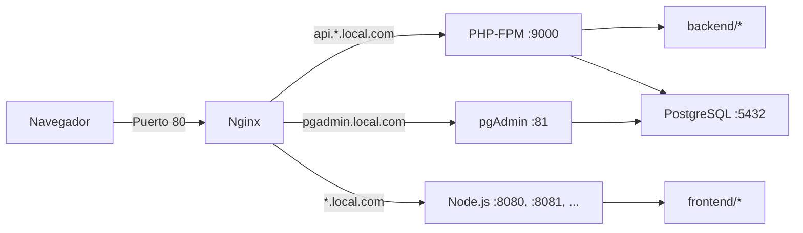

# Ambiente FullStack

Entorno Docker para ejecutar varios proyectos PHP y Node.js detrás de un solo
Nginx. Cada proyecto obtiene un dominio local sin publicar puertos adicionales
en el equipo.

Incluye:

- PHP 8.5 con PHP-FPM, Composer y Xdebug.
- Node.js 24 con pnpm.
- Nginx como proxy y servidor de dominios locales.
- PostgreSQL 16.
- pgAdmin 4.
- Dev Containers separados para backend y frontend.

## Arquitectura



Todos los backends comparten `php-app`. Todos los frontends se ejecutan dentro
de `nodejs-app`, usando un puerto interno diferente por proyecto. Nginx decide
el destino según el `server_name` definido en
`.docker/docker/app.conf`.

## Ejecución

Requisitos:

- Docker Desktop.
- Git.
- Visual Studio Code con la extensión Dev Containers, opcional.

Configura los dominios iniciales en `/etc/hosts`:

```text
127.0.0.1 wellcome.local.com api.wellcome.local.com pgadmin.local.com
```

Construye e inicia el entorno:

```bash
docker compose up -d --build
```

El puerto público de Nginx se configura en el `.env` raíz:

```dotenv
NGINX_PORT=80
```

Nginx siempre escucha en el puerto `80` dentro de Docker. `NGINX_PORT` controla
el puerto utilizado en el equipo:

- `NGINX_PORT=80`: `http://wellcome.local.com`
- `NGINX_PORT=81`: `http://wellcome.local.com:81`

Después de cambiarlo, recrea Nginx:

```bash
docker compose up -d --force-recreate nginx
```

Servicios disponibles:

| Servicio | URL o conexión |
| --- | --- |
| Frontend de ejemplo | `http://wellcome.local.com` |
| Backend de ejemplo | `http://api.wellcome.local.com` |
| pgAdmin | `http://pgadmin.local.com` |
| PostgreSQL | `localhost:5432` |

Credenciales de pgAdmin:

```text
Usuario: root@local.com
Contraseña: root
```

Comandos útiles:

```bash
docker compose ps
docker compose logs -f
docker compose down
```

## Agregar un backend

Clona el repositorio dentro de `backend`:

```bash
cd backend
git clone <repositorio> nuevo
```

El directorio completo se monta en `/var/www` dentro de `php-app` y Nginx.
Agrega un bloque en `.docker/docker/app.conf`:

```nginx
server {
    listen 80;
    server_name api.nuevo.local.com;
    root /var/www/nuevo/public;
    index index.php;

    location / {
        try_files $uri $uri/ /index.php?$query_string;
    }

    location ~ \.php$ {
        try_files $uri =404;
        include fastcgi_params;
        fastcgi_pass php-app:9000;
        fastcgi_param SCRIPT_FILENAME $document_root$fastcgi_script_name;
    }
}
```

Instala las dependencias desde el contenedor:

```bash
docker compose exec php-app sh
cd /var/www/nuevo
composer install
```

## Agregar un frontend

Clona el repositorio dentro de `frontend`:

```bash
cd frontend
git clone <repositorio> nuevo
```

Inicia el servidor dentro de `nodejs-app` en un puerto libre. Debe escuchar en
`0.0.0.0` para que Nginx pueda conectarse:

```bash
docker compose exec nodejs-app sh
cd /usr/src/app/nuevo
pnpm install
pnpm run dev --host 0.0.0.0 --port 8081
```

Agrega el dominio a `.docker/docker/app.conf` usando el mismo puerto:

```nginx
server {
    listen 80;
    server_name nuevo.local.com;

    location / {
        proxy_pass http://nodejs-app:8081;
        proxy_http_version 1.1;
        proxy_set_header Host $host;
        proxy_set_header X-Real-IP $remote_addr;
        proxy_set_header X-Forwarded-For $proxy_add_x_forwarded_for;
        proxy_set_header X-Forwarded-Proto $scheme;
        proxy_set_header Upgrade $http_upgrade;
        proxy_set_header Connection "upgrade";
    }
}
```

Usa `8082`, `8083`, etc. para más frontends. No es necesario publicar esos
puertos en `docker-compose.yml`, porque Nginx y Node comparten la red Docker.

Para cualquier proyecto nuevo, registra sus dominios:

```text
127.0.0.1 nuevo.local.com api.nuevo.local.com
```

Valida y recarga Nginx sin reconstruir los contenedores:

```bash
docker compose exec nginx nginx -t
docker compose exec nginx nginx -s reload
```

## Dev Containers

El repositorio contiene dos configuraciones:

- `.devcontainer/backend`: abre `/var/www` dentro de `php-app`.
- `.devcontainer/frontend`: abre `/usr/src/app` dentro de `nodejs-app`.

Cada Dev Container instala extensiones de VS Code adecuadas para su tecnología
y configura Zsh. El VS Code Server se almacena en volúmenes persistentes, por
lo que no debe descargarse nuevamente al recrear los contenedores:

- `backend-vscode-server`
- `frontend-vscode-server`

Ambos servicios también montan el volumen global `vscode` en `/vscode`. Ese
volumen contiene los binarios compartidos de VS Code Server y evita enlaces
rotos cuando una segunda ventana de Dev Containers recrea algún servicio.

Para abrir uno, ejecuta en VS Code:

1. `Dev Containers: Open Folder in Container...`
2. Selecciona `.devcontainer/backend` o `.devcontainer/frontend`.

También puedes abrir la carpeta raíz y usar:

1. `Dev Containers: Reopen in Container`.
2. Seleccionar la configuración de backend o frontend cuando VS Code lo pida.

Los scripts `setup.sh` son idempotentes: sólo instalan Oh My Zsh y
`zsh-autosuggestions` cuando todavía no existen.

Backend y frontend pueden abrirse al mismo tiempo en ventanas distintas de VS
Code. Ambos usan el mismo proyecto Docker Compose, pero cada configuración se
adjunta a su propio servicio sin reemplazar el comando principal del contenedor.
